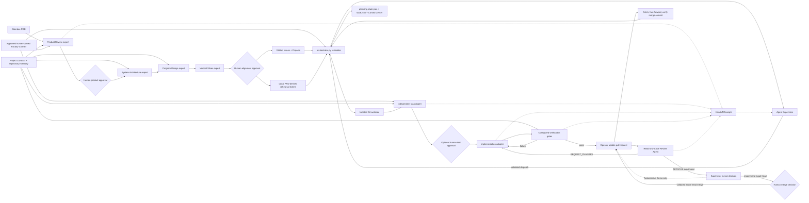

# Factory architecture map

The factory is intentionally small enough to inspect during a workshop, but the
entrypoint now coordinates planning, supervision, QA, execution, code review,
GitHub, and observability.
Use this guide instead of reading every file sequentially.

## Runtime flow

## Reading path

1. `factory.charter.toml` and `factory/factory_charter.py` — human-owned
   authority, risk, budgets, path policy, and merge boundary, bound to an
   explicitly approved policy hash.
2. `factory.project.toml` and `factory/project_contract.py` — repository
   structure, environment, QA placement, gates, reset behavior, and bounded
   agent context.
3. `factory/roles.json` and `factory/policy.json` — Agent Role contracts and
   versioned general policy.
4. `factory/factory.toml` and `.factory/local.toml` — committed adapter
   definitions and ignored attendee selections.
5. `factory/CONFIGURATION.md` — configuration precedence and adapter setup.
6. `factory/planning_pipeline.py` — expert contracts, hashes, approvals,
   traceability, validation, and planning state.
7. `factory/planner.py` — Ticket-plan validation and GitHub publication.
8. `factory/orchestrator.py` — CLI, dependency scheduler, and Ticket lifecycle.
9. `factory/supervisor.py` — receipt-driven, validated coordination proposals.
10. `factory/code_review.py` — structured PR-review validation and rendering.
11. `factory/evidence_packet.py` — Canvas validation and sanitized export.
12. `factory/github_backend.py` — Issues, Projects, reviews, and merge state.
13. `factory/github_repository.py` — GitHub target validation and checkout.
14. `factory/doctor.py` — environment and governance diagnostics.
15. `factory/control_center.py` and `factory/control_center/` — local validated
    action API and operator interface.
16. `factory/mock_agent.py`, `mock_qa_agent.py`, `mock_supervisor.py`, and
    `mock_review_agent.py` — deterministic Rehearsal adapters.

## Control boundaries

- Every planning expert is read-only and receives the PRD, approved upstream
  artifacts, Project Contract, and exact approved Factory Charter.
- Product approval precedes technical planning; alignment approval precedes
  GitHub publication.
- Artifact hashes invalidate downstream work after human edits.
- The Factory Charter is the highest repository-local authority. The Project
  Contract defines mechanics, the Factory Profile defines topology, Agent Role
  contracts narrow responsibility, and versioned policy supplies general
  rules. Lower layers cannot weaken higher ones.
- The Project Contract is the repository-mechanics interface consumed by
  planning, QA policy, preflight, verification, and reset. A changed contract
  invalidates an in-progress plan before publication.
- Profile topology determines which roles and controls are applicable.
- Standard and Assured runs add an Agent Supervisor at each dispatch checkpoint.
  It reads worker Handoff Receipts and proposes Ticket-specific dispatch or
  block commands. Lean runs keep direct scheduler dispatch.
- The orchestrator, not an agent, issues every Handoff Receipt, validates every
  Supervisor proposal, executes explicitly authorized GitHub mutations, and
  remains the only lifecycle authority.
- Each ticket runs in its own worktree and branch.
- QA may add only new ticket-numbered files under configured test roots.
- Acceptance Test hashes prevent the implementation agent from weakening that evidence.
- Required gates must pass before the candidate branch is pushed and its PR is
  opened or updated.
- Standard and Assured runs give that exact PR candidate to a separate, read-only
  Code Review Agent. `REQUEST_CHANGES` returns every comment to implementation
  within the existing retry limit. Tests, gates, and review then run again.
- `APPROVE` is revision-specific and cannot include unresolved comments. The
  Supervisor may recommend `MERGE` only for that reviewed head, with passing
  required gates and a published review decision. Standard and Assured stop at
  the human exact-revision merge command. Only explicitly opted-in Autonomous
  Demo delegates execution of the validated recommendation to the orchestrator.
  Stale revisions and branch-protection failures fail closed.
- Lean keeps a direct human diff-and-merge review. In every profile, the factory
  verifies merged code is present locally before unlocking dependent tickets.
- Worktrees provide Git isolation, not a security boundary. Replace adapter
  commands with container or remote-runner wrappers when stronger isolation is
  required.

The Control Center exposes local engine-room evidence. GitHub Projects remains the
shared backlog and dependency view; the two interfaces are deliberately not
presented as the same system.

The four planning stages currently use Claude or Codex because their adapters
enforce the planning JSON schemas. Supervision, implementation, QA, and code review accept any lowercase
adapter name registered under `[agents]` in `factory/factory.toml`. This keeps
the control flow stable while teams swap models, CLIs, wrappers, or execution
environments.
