# Factory architecture map

The factory is intentionally small enough to inspect during a workshop, but the
entrypoint now coordinates planning, QA, execution, GitHub, and observability.
Use this guide instead of reading every file sequentially.

## Runtime flow

```mermaid
flowchart LR
  PRD["Attendee PRD"] --> Product["Product Review expert"]
  Product --> ProductGate{"Human product approval"}
  ProductGate --> Architecture["System Architecture expert"]
  Architecture --> Program["Program Design expert"]
  Program --> Slices["Vertical Slices expert"]
  Slices --> Alignment{"Human alignment approval"}
  Alignment --> Issues["GitHub Issues + Projects"]
  Issues --> Scheduler["orchestrator.py scheduler"]
  Scheduler --> Worktree["Isolated Git worktree"]
  Worktree --> QA["Independent QA adapter"]
  QA --> TestReview{"Optional human test approval"}
  TestReview --> Implementer["Implementation adapter"]
  Implementer --> Gates["Configured verification gates"]
  Gates -->|failure| Implementer
  Gates -->|pass| PR["Pull request + human merge"]
  PR --> Sync["Fetch, fast-forward, verify merge commit"]
  Sync --> Scheduler
  Scheduler --> State["planning-state.json + state.json + dashboard"]
```

## Reading path

1. `factory/factory.toml` — adapters, QA policy, retry/time limits, and gates.
2. `factory/planning_pipeline.py` — four expert contracts, hashes, approvals,
   traceability, validation, and planning dashboard state.
3. `factory/planner.py` — ticket-plan validation and GitHub publication.
4. `factory/orchestrator.py` — CLI, dependency scheduler, and ticket lifecycle.
5. `factory/github_backend.py` — Issues, Projects, PRs, and merge observation.
6. `factory/doctor.py` — workshop safety and environment diagnostics.
7. `factory/dashboard.html` — read-only visualization of planning and execution.
8. `factory/mock_agent.py` and `mock_qa_agent.py` — deterministic rehearsal adapters.

## Control boundaries

- Every planning expert is read-only and receives only the PRD plus approved
  upstream contracts.
- Product approval precedes technical planning; alignment approval precedes
  GitHub publication.
- Artifact hashes invalidate downstream work after human edits.
- Each ticket runs in its own worktree and branch.
- QA may add only new ticket-numbered files under configured test roots.
- QA test hashes prevent the implementation agent from weakening those tests.
- Required gates must pass before a PR opens.
- Humans merge PRs; the factory verifies merged code is present locally before
  unlocking dependent tickets.
- Worktrees provide Git isolation, not a security boundary. Replace adapter
  commands with container or remote-runner wrappers when stronger isolation is
  required.
