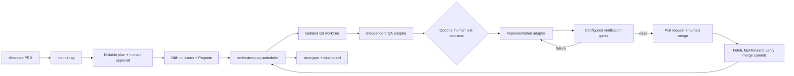

# Factory architecture map

The factory is intentionally small enough to inspect during a workshop, but the
entrypoint now coordinates planning, QA, execution, GitHub, and observability.
Use this guide instead of reading every file sequentially.

## Runtime flow

## Reading path

1. `factory/factory.toml` — adapters, QA policy, retry/time limits, and gates.
2. `factory/planner.py` — structured PRD planning and ticket publication.
3. `factory/orchestrator.py` — dependency scheduler and ticket lifecycle.
4. `factory/github_backend.py` — Issues, Projects, PRs, and merge observation.
5. `factory/doctor.py` — workshop safety and environment diagnostics.
6. `factory/dashboard.html` — read-only visualization of state and artifacts.
7. `factory/mock_agent.py` and `mock_qa_agent.py` — deterministic rehearsal adapters.

## Control boundaries

- Planning is read-only until a human approves the generated plan.
- Each ticket runs in its own worktree and branch.
- QA may add only new ticket-numbered files under configured test roots.
- QA test hashes prevent the implementation agent from weakening those tests.
- Required gates must pass before a PR opens.
- Humans merge PRs; the factory verifies merged code is present locally before
  unlocking dependent tickets.
- Worktrees provide Git isolation, not a security boundary. Replace adapter
  commands with container or remote-runner wrappers when stronger isolation is
  required.
