# Factory architecture map

The factory is intentionally small enough to inspect during a workshop, but the
entrypoint now coordinates planning, QA, execution, GitHub, and observability.
Use this guide instead of reading every file sequentially.

## Runtime flow

```mermaid
flowchart LR
  PRD["Attendee PRD"] --> Product["Product Review expert"]
  Product --> ProductGate{"Human product approval"}
  ProductGate --> Architecture["System Architecture expert"]
  Architecture --> Program["Program Design expert"]
  Program --> Slices["Vertical Slices expert"]
  Slices --> Alignment{"Human alignment approval"}
  Alignment --> Issues["GitHub Issues + Projects"]
  Alignment --> Rehearsal["Local PRD-derived rehearsal tickets"]
  Issues --> Scheduler["orchestrator.py scheduler"]
  Rehearsal --> Scheduler
  Scheduler --> Worktree["Isolated Git worktree"]
  Worktree --> QA["Independent QA adapter"]
  QA --> TestReview{"Optional human test approval"}
  TestReview --> Implementer["Implementation adapter"]
  Implementer --> Gates["Configured verification gates"]
  Gates -->|failure| Implementer
  Gates -->|pass| PR["Pull request + human merge"]
  PR --> Sync["Fetch, fast-forward, verify merge commit"]
  Sync --> Scheduler
  Scheduler --> State["planning-state.json + state.json + dashboard"]
  Product -.-> Receipts["Handoff Receipts"]
  QA -.-> Receipts
  Implementer -.-> Receipts
  Gates -.-> Receipts
```

## Reading path

1. `factory/roles.json` and `factory/policy.json` — Agent Role contracts and
   versioned repository policy.
2. `factory/factory.toml` — committed adapters, QA policy, retry/time limits,
   and gates; `.factory/local.toml` — ignored attendee defaults and Project selection.
3. `factory/CONFIGURATION.md` — built-in, mixed-role, and custom adapter setup.
4. `factory/planning_pipeline.py` — profile-driven expert contracts, hashes, approvals,
   traceability, validation, and planning dashboard state.
5. `factory/planner.py` — ticket-plan validation and GitHub publication.
6. `factory/orchestrator.py` — CLI, dependency scheduler, and ticket lifecycle.
7. `factory/evidence_packet.py` — Canvas validation and sanitized Evidence Packet export.
8. `factory/github_backend.py` — Issues, Projects, PRs, and merge observation.
9. `factory/doctor.py` — workshop safety and environment diagnostics.
10. `factory/dashboard.html` — read-only visualization of planning and execution.
11. `factory/mock_agent.py` and `mock_qa_agent.py` — deterministic rehearsal adapters.

## Control boundaries

- Every planning expert is read-only and receives only the PRD plus approved
  upstream contracts.
- Product approval precedes technical planning; alignment approval precedes
  GitHub publication.
- Artifact hashes invalidate downstream work after human edits.
- Profile topology determines which roles and controls are applicable.
- The orchestrator, not an agent, issues every Handoff Receipt.
- Each ticket runs in its own worktree and branch.
- QA may add only new ticket-numbered files under configured test roots.
- Acceptance Test hashes prevent the implementation agent from weakening that evidence.
- Required gates must pass before a PR opens.
- Humans merge PRs; the factory verifies merged code is present locally before
  unlocking dependent tickets.
- Worktrees provide Git isolation, not a security boundary. Replace adapter
  commands with container or remote-runner wrappers when stronger isolation is
required.

The dashboard exposes local engine-room evidence. GitHub Projects remains the
shared backlog and dependency view; the two interfaces are deliberately not
presented as the same system.

The four planning stages currently use Claude or Codex because their adapters
enforce the planning JSON schemas. Implementation and QA accept any lowercase
adapter name registered under `[agents]` in `factory/factory.toml`. This keeps
the control flow stable while teams swap models, CLIs, wrappers, or execution
environments.
