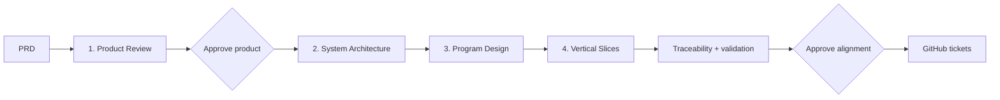

# Profile-driven planning pipeline

The factory treats planning as a sequence of reviewable contracts, not a single
request to generate tickets. A fresh read-only agent owns each stage. Stable IDs
and hashes make disagreements visible before implementation becomes expensive.

The Standard and Assured profiles run all four experts. Lean runs Product
Review and Vertical Slices only; its slice contract traces requirements
directly because architecture and program artifacts are not applicable.
Product Review and final alignment are always human gates. The approved Factory
Charter may also require exact-hash approval after System Architecture or
Program Design; `continue-plan` stops at each selected gate instead of starting
the next expert.



## Expert responsibilities

| Expert | Decides | Must not decide | Key IDs |
| --- | --- | --- | --- |
| Product Review | Problem, users, behavior, journeys, scope, evidence, mockup needs | Components, files, tickets | `R*`, `U*`, `J*` |
| System Architecture | Components, ownership, contracts, data models, constraints, risks | Function signatures or tickets | `C*`, `CT*`, `D*`, `ADR*` |
| Program Design | Modules, paths, types, signatures, call flows, errors, test seams | Backlog sequencing | `MOD*`, `TYPE*`, `FN*`, `FLOW*`, `TEST*` |
| Vertical Slices | End-to-end tickets, dependencies, file ownership, QA evidence | New product scope | `T*` plus upstream IDs |

The exact prompt builders are in `planning_pipeline.stage_prompt`. Their shared
rules are: preserve scope, keep upstream IDs, surface human decisions as
blocking questions, and return only schema-valid JSON. The role-specific parts
make the separation explicit:

- Product Review: clarify the outcome; do not design architecture or tickets.
- System Architecture: give every requirement an owning component and explicit
  component contracts; do not write low-level code.
- Program Design: define modules, types, signatures, calls, error behavior, and
  test seams; do not create tickets.
- Vertical Slices: create observable end-to-end changes that map requirements,
  contracts, program elements, owned files, and QA evidence.

Schemas are under `factory/planning_schemas/`. Every invocation also records the
rendered prompt and CLI log under `.factory/prompts/` and `.factory/logs/`.
The prompt includes a bounded repository inventory and the reviewed
`factory.project.toml`; the PRD still remains the only source of product scope.
Each prompt also includes its versioned Agent Role contract and applicable
`workshop-policy-v1` rules. Every successful or failed stage writes a Handoff
Receipt with revision hashes, verification, risks, artifacts, and policy hashes.

## Human workflow

Claude is the worked example below. Use `codex-workshop` for an all-Codex run,
or configure any registered supervision, implementation, QA, and code-review adapters before planning.
Planning itself currently uses Claude or Codex because it requires structured
output against the stage schemas. See `CONFIGURATION.md`.

```sh
./factory/factory configure \
  --github-repository https://github.com/YOUR-NAME/YOUR-REPOSITORY \
  --preset claude-workshop
./factory/factory plan PRD.md
./factory/factory review product PLAN_ID
./factory/factory revise PLAN_ID product \
  --feedback "Require objective evidence for the disputed behavior"
./factory/factory review product PLAN_ID
./factory/factory approve-product PLAN_ID
./factory/factory continue-plan PLAN_ID
# Only when selected by factory.charter.toml:
./factory/factory review architecture PLAN_ID
./factory/factory approve-stage architecture PLAN_ID
./factory/factory continue-plan PLAN_ID
./factory/factory review program PLAN_ID
./factory/factory approve-stage program PLAN_ID
./factory/factory continue-plan PLAN_ID
./factory/factory review alignment PLAN_ID
./factory/factory approve PLAN_ID --new-project-title "Workshop"
```

`plan` stops after Product Review. `revise` records human feedback and revision
history, reruns only the named expert, clears affected approvals, and marks
downstream artifacts stale. If a technical expert blocks, answer its questions
in the Control Center; the panel submits those decisions, revises that artifact,
and resumes the valid downstream stages. The equivalent CLI recovery is:

```sh
./factory/factory revise PLAN_ID architecture \
  --feedback "Decision 1: keep the service in this repository. Decision 2: disable analytics for v1."
./factory/factory continue-plan PLAN_ID
```

The other technical stage names are `program` and `slices`. `continue-plan`
runs the remaining applicable experts sequentially, stopping if any expert has
blocking questions or reaches a Charter-selected human gate. Intermediate
approval records the exact artifact hash and is invalidated when that artifact
or any upstream contract changes. `approve` combines
the final alignment authorization with publication, so no GitHub issue exists
before a human accepts the whole package.

Vertical Slices also feed declared file ownership through the Charter path
classifier. A load-bearing slice selects both intermediate approvals; a slice
in `requires_human_approval` keeps the human merge boundary but does not add an
intermediate planning gate. The selected risk, paths, gate level, and approvals
are stored as `planning_controls` in the manifest and shown in the Control
Center.

For a credential-free rehearsal, add `--mock` to `plan` and `continue-plan`.
The bundled TableStory artifacts follow the same schemas, validators, manifest,
approval gates, traceability generation, and Control Center state as live agents.
Its initial R4 evidence is deliberately vague, so the attendee must reject and
revise it before approval.

After reviewing alignment, record that decision and materialize the reviewed
slices without GitHub:

```sh
./factory/factory approve-rehearsal PLAN_ID
./factory/factory run --mock --scenario recipe-rebrand --dry-run
```

Type `APPROVE ALIGNMENT`. No GitHub issue or Project item is created.

The local tickets retain the approved titles, specifications, acceptance
criteria, dependencies, and plan markers. Deterministic scenario actions supply
execution behavior only.

Live planning accepts any readable Markdown PRD. For an existing project, run
`factory init --repo /path/to/project`, review its Project Contract, and launch
the Control Center against that path first. If the contract or repository
inventory changes during planning, approval is cleared and the factory requires
a fresh plan so technical tickets do not use stale paths or gates.

## Ticket provenance

The normal backlog is the output of planning. Product Review derives stable
requirements from the PRD. Architecture and Program Design make the contracts
and code boundaries explicit. Vertical Slices then turns that approved package
into dependency-mapped tickets. Only `factory approve` publishes those slices
as GitHub Issues.

`factory seed recipe-rebrand` is different. It copies a bundled, deterministic
ticket fixture directly to GitHub and skips all four experts and both human
planning gates. Use it for recovery, offline rehearsal, or a time-boxed demo;
do not present it as the Live Run workflow.

## Validation and invalidation

Before publication, the factory verifies:

- all stable-ID references resolve;
- every requirement has an architecture owner and implementing slice;
- every program element has a ticket owner;
- every ticket has a vertical outcome, acceptance criteria, file ownership, and
  QA evidence;
- dependencies form an acyclic graph;
- tickets that can run in parallel do not claim the same file;
- no blocking question remains;
- every traceability row reaches both a slice and QA evidence.

`manifest.json` records the PRD hash, artifact hashes, input hashes, prompt
version, expert, timestamps, logs, and approvals. If a person edits an approved
upstream JSON artifact, downstream stages become stale and the relevant human
approval is cleared. The next command explains which review must be repeated.

When structured output fails deterministic validation, the factory stores the
validator message and rejected JSON under the planning run's `rejected/`
directory. A retry sends both back to the same expert together with the exact
allowed upstream IDs. Valid upstream stages are reused. If that repair repeats
the error, the Control Center accepts a concrete human correction and uses the
rejected JSON as the revision source; the replacement must pass validation
before planning resumes. The Control Center distinguishes this repairable
validation failure from an agent authentication or provider failure. A Live Run
may use another configured planning adapter; the adapter transition is recorded
in `planning_agent_history`.

If the PRD, Project Contract, or approved Factory Charter changes, retrying an
expert is not valid: the old run is bound to different inputs. The Control
Center labels this as a governance change and offers **Restart planning
safely**. That action keeps the saved PRD and invalidated artifacts, then
regenerates the planning run under the current approved governance. It does not
change existing GitHub tickets.
