# Software (re)-Factory workshop outline

Release: `workshop-v1.0.0`

Build an AI factory and follow one requirement from product intent to verified
delivery.

Participants use Git, their preferred agent CLIs, GitHub Projects, automated
tests, and a local dashboard. The example converts Pocket Cinema, a multimedia
demo app, into TableStory, a responsive recipe application.

## Learning objectives

By the end of the workshop, participants can:

- turn a PRD into product, architecture, program-design, and vertical-slice
  contracts;
- review and approve agent decisions before code is generated;
- represent dependencies as safe execution waves;
- run QA and implementation agents in isolated Git worktrees;
- inspect prompts, logs, diffs, protected tests, and gate output;
- explain why a ticket passed, retried, or became blocked; and
- choose a Lean, Standard, or Assured Factory Profile for a concrete delivery
  risk; and
- export a sanitized Evidence Packet and peer-reviewed Factory Canvas.

## Audience and format

The workshop is for software engineers, tech leads, engineering managers, and
developer-experience teams. Participants should understand branches, pull
requests, test commands, and basic command-line use. They don't need experience
building agent orchestrators.

Use the Self-paced Rehearsal Run for deterministic local work. Use the
Instructor-led Live Run when attendees should create real GitHub issues,
Project items, worktrees, and pull requests. Every attendee creates and owns a
separate repository from the workshop template. The facilitator uses a
different repository, and peers review one another's repositories without
sharing implementation state.

## Workflow at a glance

```mermaid
flowchart LR
  PRD --> Product["Product Review"] --> ProductGate["Human product approval"]
  ProductGate --> Architecture["System Architecture"] --> Program["Program Design"]
  Program --> Slices["Vertical Slices"] --> AlignmentGate["Human alignment approval"]
  AlignmentGate --> Tickets["GitHub tickets"] --> QA["Independent Acceptance Tests"]
  QA --> Build["Isolated implementation"] --> Gates["Verification gates"]
  Gates --> PR["Pull request and merge"] --> Sync["Synchronize dependencies"]
  Sync --> Evidence["Inspect evidence and adapt"]
```



## Prerequisites

### Required for both modes

| Requirement | Minimum | Why it is needed |
| --- | --- | --- |
| Operating system | macOS, Linux, or Windows with WSL 2 | The scripts use a POSIX shell and Git worktrees. |
| Python | 3.11 or later, with `venv` | Runs the factory, Flask app, and Python tests. |
| Node.js | 20 or later | Runs the JavaScript acceptance tests. |
| Git | A current command-line installation | Creates branches, commits, and worktrees. |
| Browser | A current Chrome, Edge, Firefox, or Safari | Opens the app and local dashboard. |
| Local access | Permission to create sibling directories | The factory creates disposable checkouts and worktrees. |
| Ports | 5000, 5050, and 8000 available | Serves the app, alternate app process, and dashboard. |

Check the core tools before the session:

```sh
python3 --version
node --version
git --version
```

A Rehearsal Run needs no GitHub write access, model credentials, or API key. It
uses deterministic planning, QA, and implementation agents while preserving the
same worktree, dependency, protected-test, and verification flow.

### Additional requirements for a Live Run

- A repository created by the attendee from the public, versioned workshop
  template. The owner publishes the template and tag `workshop-v1.0.0` the day
  before delivery.
- GitHub CLI (`gh`) authenticated to an account that can create and push to a
  disposable repository.
- GitHub token scope `project`, plus permission to create issues, Projects, and
  pull requests for that repository.
- A current, authenticated Claude or Codex CLI for the four structured planning
  stages. The worked example uses Claude and requires no API key.
- A current, authenticated agent CLI or wrapper for implementation and QA.
  Built-in adapters support Claude, Codex, and Cursor; teams can register their
  own noninteractive adapter in `factory/factory.toml`.
- Network access to GitHub and the selected agent provider.
- A clean default branch synchronized with the GitHub repository.

Check Live Run authentication:

```sh
gh auth status
gh auth refresh -s project
claude auth login
claude auth status --text
```

If you choose Codex or a custom adapter, use that CLI's normal login flow and
follow `factory/CONFIGURATION.md`. Keep credentials outside the repository.

## Step 1: Set up and run preflight

### Rehearsal Run

```sh
git clone https://github.com/giolaq/software-refactory-workshop.git
cd software-refactory-workshop
./setup_demo.sh --scenario recipe-rebrand
```

Expected result: setup ends with
`Factory reset complete for scenario: recipe-rebrand`.

### Instructor-led Live Run

Use a disposable repository. Don't run the workshop against a repository that
contains unrelated work.

```sh
gh repo create software-refactory-dry-run \
  --private \
  --template giolaq/software-refactory-workshop \
  --clone
cd software-refactory-dry-run
./setup_demo.sh --scenario recipe-rebrand
git push origin main
./factory/factory configure --preset claude-workshop
./factory/factory doctor --full
```

Choose another repository name if `software-refactory-dry-run` already exists.
The public source must have GitHub template mode enabled before this command.
The Claude preset is the worked example. Before setup, attendees may instead
choose the Codex preset, mix built-in adapters by role, or register their own
implementation and QA adapter as described in `factory/CONFIGURATION.md`.
Continue only when the doctor reports zero failures. Warnings about an optional
agent are acceptable when that agent won't be used.

## Terminal layout

Use separate terminals so long-running processes remain visible:

| Terminal | Purpose | Typical command |
| --- | --- | --- |
| A | Factory commands | `./factory/factory …` |
| B | Dashboard server | `python3 -m http.server 8000` |
| C, optional | Demo application | `.factory/venv/bin/python demo-app/app.py` |

Open the dashboard at `http://localhost:8000/factory/dashboard.html` and the
application at `http://localhost:5000`.

## Workshop schedule

| Time | Step | Developer outcome |
| --- | --- | --- |
| 0–5 min | Readiness and pairing | Each attendee owns a ready repository and has a peer reviewer. |
| 5–13 min | Define the factory and inspect Pocket Cinema | Participants identify the operating model and existing product surface. |
| 13–20 min | Read the TableStory PRD | The group agrees on outcomes, constraints, and risks. |
| 20–35 min | Revise Product Review | Participants reject vague R4 evidence and approve an objective revision. |
| 35–50 min | Trace R3 | R3 connects across all four planning artifacts. |
| 50–58 min | Align and publish | Approved Vertical Slices become tickets and Project items. |
| 58–68 min | Review Acceptance Tests | QA-owned evidence is approved before implementation. |
| 68–85 min | Run the factory | Participants trace Plan, Build, Verify, and Review, including one retry. |
| 85–91 min | Verify the app and evidence | The group verifies TableStory and previews delivery evidence. |
| 91–98 min | Review the Factory Canvas | Peers challenge one another's factory design. |
| 98–100 min | Export and close | Participants export a sanitized Evidence Packet and choose a next experiment. |

## Step 2: Inspect the starting product

Start the application:

```sh
.factory/venv/bin/python demo-app/app.py
```

Open `http://localhost:5000`. Search for a film and open its details. Ask the
group which parts of the application must change. Expected
answers include the data model, URLs, APIs, copy, accessibility labels, saved
items, navigation, tests, and documentation.

**Checkpoint:** Participants can explain why the work is a domain conversion,
not a cosmetic rebrand.

## Step 3: Read the PRD

Open `recipe-app-prd.md` and identify:

- the user journey: find a recipe, inspect it, save it, and use it on mobile or
  TV;
- terms and public interfaces that must change;
- Flask, vanilla JavaScript, and offline constraints;
- objective completion evidence; and
- the shared recipe data and API work that other slices will depend on.

**Checkpoint:** The group can state the expected user outcome and the highest
integration risk in one sentence each.

## Step 4: Review and approve product intent

Run only Product Review:

```sh
# Live Run
./factory/factory plan recipe-app-prd.md

# Rehearsal Run
./factory/factory plan recipe-app-prd.md --mock
```

Save the printed `PLAN_ID`, then review the product contract:

```sh
./factory/factory review product PLAN_ID
```

Check users, journeys, scope, evidence, assumptions, mockup needs, and blocking
questions. The Rehearsal Run intentionally describes R4 TV Back behavior with
weak walkthrough evidence. Reject it and record the required objective result:

```sh
# Add --mock in a Rehearsal Run.
./factory/factory revise PLAN_ID product \
  --feedback "Require automated Escape and Backspace checks that preserve mode=tv and restore focus."
./factory/factory review product PLAN_ID
```

The revision preserves history, reruns only Product Review, invalidates its
approval, and marks downstream work stale.

```sh
./factory/factory approve-product PLAN_ID
```

**Checkpoint:** Product Review is approved.

## Step 5: Align architecture, program design, and slices

```sh
# Live Run
./factory/factory continue-plan PLAN_ID

# Rehearsal Run
./factory/factory continue-plan PLAN_ID --mock

# Both modes
./factory/factory review alignment PLAN_ID
```

Review four things:

1. Architecture assigns component ownership and defines data and API contracts.
2. Program design names modules, types, signatures, call flows, errors, and test
   seams.
3. R3 passes through Product Review, System Architecture, Program Design, and
   Vertical Slices before it reaches QA evidence.
4. Each planning role produced a Handoff Receipt with revision and policy hashes.

In a Live Run, publish the approved plans to a new GitHub Project:

```sh
./factory/factory approve PLAN_ID \
  --new-project-title "TableStory Workshop"
```

The approval creates tickets from the PRD-derived Vertical Slices, adds them to
the Project, and remembers the Project number. Dependency-free issues should be
Ready; the remaining issues should be Backlog. Seeding is not part of this path.

In a Rehearsal Run, record the same alignment decision without GitHub and
materialize the reviewed Vertical Slices as the local deterministic backlog:

```sh
./factory/factory approve-rehearsal PLAN_ID
./factory/factory run --mock --scenario recipe-rebrand --dry-run
```

Type `APPROVE ALIGNMENT`. The command writes local state only and does not
contact GitHub.

The preview must use the approved slice titles and dependencies. The scenario
adds deterministic execution actions; it does not replace the PRD-derived
ticket contracts.

**Checkpoint:** The plan has no orphan requirement, dependency cycle, or
overlapping parallel file ownership.

## Step 6: Let QA define acceptance criteria

Start the dashboard in Terminal B:

```sh
python3 -m http.server 8000
```

Start the factory in Terminal A:

```sh
# Live Run
./factory/factory run

# Rehearsal Run
./factory/factory run --mock \
  --scenario recipe-rebrand \
  --review-qa-tests \
  --once
```

When a ticket enters **QA Review**, inspect its specification, QA prompt, log,
test diff, and protected-test list. Approve tests only when their assertions
prove user-visible behavior.

```sh
# Live Run
./factory/factory approve-tests ISSUE_NUMBER

# Rehearsal Run: first execution wave
./factory/factory approve-tests 1 --yes
./factory/factory approve-tests 2 --yes
```

**Checkpoint:** At least one independent test set is approved before its
implementation starts.

## Step 7: Run and observe the factory

The factory resumes approved work, runs verification gates, and opens a pull
request when the gates pass. Inspect four artifacts for each ticket:

- the prompt describes the authorized scope;
- the log shows the current agent activity;
- changed files define the review surface; and
- gate output explains pass, retry, or block decisions.

In a Rehearsal Run, finish the deterministic scenario without additional human
pauses:

```sh
./factory/factory run --mock --scenario recipe-rebrand --once
```

The first deterministic implementation of the mobile recipe slice is incomplete. Its
protected Acceptance Test fails, verification records the failure, and the
bounded second attempt succeeds. Use that visible recovery to explain why a
claim of completion cannot advance a ticket.

In a Live Run, review and merge a green pull request. Wait for the dashboard
event **PR merged and synchronized**. A dependent ticket must not start until
the merged commit is reachable from the local default branch.

**Checkpoint:** Ticket transitions are visible.

## Step 8: Verify, design, and export

Run the application and verify its required journeys:

- search by recipe title and ingredient;
- open a recipe and inspect its metadata, ingredients, and steps;
- add and remove a recipe from My Cookbook;
- navigate the TV app using only keys;
- find obsolete cinema terminology in UI, APIs, metadata, tests, and docs.

Then trace requirement R3 through Product Review, its Vertical Slice, the
GitHub ticket, the approved acceptance evidence, gate output, and merge. Ask
participants which Factory Profile addresses a real risk in one of their own
repositories and which controls would add ceremony.

Generate and complete the nine-section Canvas. Exchange it with a peer before
exporting evidence:

```sh
./factory/factory canvas --output factory-canvas.md
# Complete and peer review the Canvas.
./factory/factory evidence PLAN_ID --canvas factory-canvas.md
```

The Evidence Packet includes planning artifacts, approvals, traceability,
selected ticket and pull-request links, protected-test metadata, gate results,
Handoff Receipts, the Canvas, and artifact hashes. It excludes raw prompts,
raw logs, command output, environment values, tokens, and credentials. Missing
evidence is reported rather than inferred.

Completion requires a revised Product Review, PRD-derived tickets, a reviewed
QA-owned Acceptance Test, one complete ticket trace, a sanitized Evidence
Packet, and a peer-reviewed Canvas.


## Recovery plan

Use these fallbacks during a dry run:

| Problem | Action |
| --- | --- |
| GitHub, Wi-Fi, or agent CLI is unavailable | Switch to `./factory/factory run --mock --scenario recipe-rebrand --once`. |
| Planning model is unavailable | Add `--mock` to `plan` and `continue-plan`. |
| A ticket is blocked | Inspect its log and gate output, then run `./factory/factory retry ISSUE`. |
| A worktree or port is already in use | Stop the old process or create a fresh disposable checkout. |
| The demo state is stale | Run `./setup_demo.sh --scenario recipe-rebrand --force` only after confirming demo changes can be discarded. |
| Time is running short | Show one QA review and one dependency unlock, then use the deterministic run to finish. |

## Close the workshop

End with five developer rules:

1. Treat agent output as a proposal until it crosses an explicit gate.
2. Plan user behavior, system contracts, and program shape before parallel code.
3. Split work by end-to-end value and explicit file ownership.
4. Keep QA independent and protect its acceptance tests.
5. Export only the sanitized evidence a reviewer needs; keep raw operational
   data local.

The same controls apply when attendees replace the example agents. Ask them to
identify the implementation command, QA command, model choice, execution
boundary, test roots, and gates they would configure for one of their own
repositories.

The workshop is a coordination reference, not a secured multi-tenant service.
Production adoption also requires untrusted-code sandboxing, credential
isolation, spend and concurrency controls, audit retention, idempotent
recovery, branch protection, supply-chain controls, observability, and
organization policy enforcement.
