# Software (re)-Factory workshop

Learn how to coordinate multiple coding agents without giving up human control.

In this workshop, you start with a product requirements document (PRD), align
four expert planning agents on product behavior, architecture, program design,
and vertical slices, then run implementation agents in isolated Git worktrees.
A separate QA agent writes acceptance tests before implementation. You review
both planning contracts and delivery evidence while a live dashboard shows the
state of every planning stage and ticket.

The workshop uses Codex in the examples. The same factory can run Claude Code
or Cursor by changing the agent adapter.

## What you'll learn

By the end of the workshop, you can:

- Convert a PRD into reviewable product, architecture, program-design, and
  vertical-slice contracts.
- Trace requirements through contracts and code design to tickets and QA evidence.
- Identify dependencies and safe opportunities for parallel work.
- Assign different agent CLIs to planning, QA, and implementation tasks.
- Isolate concurrent changes with Git branches and worktrees.
- Require independent acceptance tests before implementation begins.
- Use automated gates and retry loops to verify agent changes.
- Inspect prompts, logs, diffs, and test output from one dashboard.
- Decide when a ticket can continue, needs review, or should be blocked.
- Extend the factory with your own models, tools, gates, and execution environments.

## Audience

This workshop is for software engineers, technical leads, engineering managers,
and developer-experience teams who want to coordinate coding agents across a
real delivery workflow.

Participants should be comfortable with Git branches, pull requests, and test
commands. They don't need prior experience building agent orchestration systems.

## Duration

Allow 100 minutes for the guided workshop and 10 to 20 minutes for questions.

| Time | Module | Outcome |
| --- | --- | --- |
| 0–8 min | Introduce the factory | Understand the control problem and the target product. |
| 8–18 min | Product Review | Agree on users, behavior, scope, journeys, evidence, and mockup needs. |
| 18–38 min | Technical alignment | Review architecture, program design, vertical slices, and traceability. |
| 38–45 min | Publish tickets | Create an auditable GitHub Project after alignment approval. |
| 45–60 min | Start the factory | Run QA and implementation agents in isolated worktrees. |
| 60–70 min | Review QA tests | Approve evidence before implementation continues. |
| 70–82 min | Observe verification | Follow a test failure, repair prompt, and retry. |
| 82–92 min | Merge and synchronize | Unlock dependent work only after the merged commit is available. |
| 92–100 min | Extend the system | Map the factory to your team's tools and policies. |

## Before you begin

Prepare the following:

- Python 3.11 or later.
- Node.js 20 or later.
- Git and the GitHub CLI.
- A clean clone of the workshop repository.
- GitHub authentication with Projects permission for the live exercise.
- At least one supported agent CLI: Codex, Claude Code, or Cursor.

Run the preflight before the session:

```sh
./factory/factory doctor --full --agent codex --qa-agent codex
```

> **Note:** Keep a deterministic mock checkout ready. It exercises the same
> worktree, QA, protected-test, dependency, and verification flow without model
> credentials or GitHub writes.

## Workshop scenario

The starting application is **Pocket Cinema**, a mobile film browser. The PRD
asks the team to transform it into **TableStory**, a responsive recipe app with
mobile and TV experiences.

The change is intentionally larger than a single prompt. It requires data and
API work, a new visual system, mobile integration, TV navigation, tests, and
documentation. Four planning experts establish the aligned contracts before the
Vertical Slices expert divides the outcome into five tickets.

## How the factory works

```mermaid
flowchart LR
  PRD["PRD"] --> Product["Product Review"]
  Product --> ProductGate["Human product approval"]
  ProductGate --> Architecture["System Architecture"]
  Architecture --> Program["Program Design"]
  Program --> Slices["Vertical Slices"]
  Slices --> Alignment["Human alignment approval"]
  Alignment --> Board["GitHub Issues and Project"]
  Board --> QA["QA agent writes tests"]
  QA --> TestReview["Optional human test review"]
  TestReview --> Build["Implementation agents in worktrees"]
  Build --> Gates["Verification gates"]
  Gates -->|Fail| Build
  Gates -->|Pass| PR["Pull request and human merge"]
  PR --> Sync["Synchronize merged commit"]
  Sync --> Board
```



The factory separates proposal, authorization, execution, and verification:

1. Four planning experts create separate, schema-validated contracts.
2. A human approves product intent before technical planning continues.
3. A human approves the aligned package before GitHub issues are created.
4. The QA agent writes ticket-specific acceptance tests first.
5. The implementation agent cannot modify the protected QA tests.
6. Required gates must pass before the factory opens a pull request.
7. A human merges the pull request.
8. Dependent tickets unlock only after the merged commit is synchronized locally.

## Module 1: Introduce the control problem

### Goal

Explain why coordinating coding agents requires more than running several
terminal sessions.

### Show

- The Pocket Cinema baseline.
- The TableStory PRD and expected product outcome.
- The empty GitHub Project and local factory dashboard.

### Explain

A software factory needs explicit work boundaries, dependency management,
isolated changes, independent verification, and a human-controlled release path.
Parallelism is useful only when the resulting work remains observable and safe
to integrate.

### Check for understanding

Ask: “Which decisions should an agent propose, and which decisions should a
human authorize?”

## Module 2: Align product intent

### Goal

Turn the PRD into an explicit statement of product behavior without changing
the repository or GitHub.

### Run

```sh
./factory/factory plan recipe-app-prd.md
./factory/factory review product PLAN_ID
./factory/factory approve-product PLAN_ID
```

### Show

- Stable product requirements and success evidence.
- Users, journeys, edge cases, scope, assumptions, and mockup needs.
- Blocking questions and the explicit product approval gate.

### Explain

Planning is read-only. Product approval authorizes technical planning, not code,
GitHub publication, or implementation.

> **Tip:** If the product contract is vague, stop here. Architecture cannot fix
> an outcome that the group has not agreed upon.

## Module 3: Align the technical plan and publish tickets

### Goal

Turn approved behavior into architecture, program design, and safe vertical
slices, then make the result an explicit contract between humans and agents.

### Run the experts

```sh
./factory/factory continue-plan PLAN_ID
./factory/factory review alignment PLAN_ID
```

### Review

For each ticket, confirm that:

- Every requirement maps to a component, contract, program element, slice, and
  QA evidence in the traceability matrix.
- The scope can be implemented and reviewed independently.
- Acceptance criteria describe behavior rather than implementation preference.
- Dependencies represent real integration constraints.
- Parallel tickets don't modify the same files unnecessarily.
- Program types, method signatures, layout, and call flows are concrete enough
  to constrain implementation.
- Open questions are resolved before publication.

### Run

```sh
./factory/factory approve PLAN_ID \
  --new-project-title "TableStory Workshop"
```

### Show

Open the new GitHub Project. Point out that dependency-free tickets are Ready
and dependent tickets remain Backlog.

### Explain

Approval is the authorization boundary. Until the human approves the plan, no
issues are published and no implementation agent starts.

## Module 4: Start QA and implementation agents

### Goal

Run concurrent work while keeping each ticket isolated and observable.

### Run

```sh
./factory/factory run \
  --agent codex \
  --qa-agent codex \
  --review-qa-tests \
  --max-parallel 4 \
  --project-number PROJECT_NUMBER
```

### Show

- One Git worktree and branch per active ticket.
- The transition from Ready to QA and QA Review.
- The ticket-specific QA prompt, log, and new tests.
- Concurrent tickets from the same dependency wave.

### Explain

Git worktrees isolate branches and working files. They are not a security
boundary. Teams that need stronger isolation can replace the adapter command
with a container, sandbox, or remote execution environment.

## Module 5: Review acceptance tests

### Goal

Use independent tests as the implementation contract.

### Inspect

Open a ticket in the dashboard and review:

- The original specification and acceptance criteria.
- The QA agent's prompt and log.
- The added test files and diff.
- The recorded hashes for protected tests.

### Run

```sh
./factory/factory approve-tests ISSUE_NUMBER
```

### Explain

After approval, the implementation agent can add more tests but cannot weaken,
rename, or delete the QA tests. A protected-test change fails verification.

> **Warning:** A passing test is useful only when it represents the requirement.
> Human test review remains important for high-risk or ambiguous work.

## Module 6: Observe verification and retries

### Goal

Show how failures become bounded repair work instead of hidden agent behavior.

### Show

- Live implementation output in the dashboard.
- Changed files for the ticket.
- Required gate commands and results.
- A failed gate and the next repair attempt.

### Explain

When a required gate fails, the factory sends the relevant failure output back
to the same ticket agent. Retries are limited. If the issue remains unresolved,
the ticket moves to Blocked and its worktree is preserved for inspection.

Use the TV scenario to demonstrate an intentional block:

```sh
./setup_demo.sh --scenario tv --force
./factory/factory run --mock --scenario tv --once
```

Ticket 8 is rejected because “It feels right” isn't an objectively testable
acceptance criterion.

## Module 7: Merge and unlock dependent work

### Goal

Connect human code review to safe dependency scheduling.

### Show

- A pull request with passing verification evidence.
- The human merge action.
- The “PR merged and synchronized” history event.
- The next dependent ticket moving from Backlog to Ready.

### Explain

The factory fetches and fast-forwards the default branch, then verifies that the
merge commit is reachable. It doesn't unlock dependent tickets based only on a
GitHub status change. The next worktree therefore starts from code that includes
the dependency.

## Module 8: Inspect the finished product

### Goal

Connect orchestration evidence to a visible product outcome.

### Run

```sh
.factory/venv/bin/python demo-app/app.py
```

Open:

- `http://localhost:5000/` for the responsive recipe browser.
- `http://localhost:5000/?mode=tv` for keyboard-driven TV navigation.

### Discuss

Review which tickets ran in parallel, where human approval changed the flow,
which tests protected the requirements, and how the dependency chain shaped the
final integration order.

## Module 9: Map the factory to your environment

Ask participants to identify one replacement or extension in each category:

| Factory component | Example team integration |
| --- | --- |
| Planning agent | Organization-specific planning prompt or model |
| Ticket backend | GitHub Projects, Jira, or Linear |
| Agent adapter | Codex, Claude Code, Cursor, or an internal CLI |
| Execution environment | Worktree, container, CI runner, or remote sandbox |
| QA policy | Security, accessibility, performance, or contract-test agent |
| Verification gate | Unit tests, lint, type checks, policy checks, or deploy preview |
| Human approval | Test review, pull request review, or release approval |
| Dashboard | Team observability and audit system |

The adapter commands, QA policy, retry limits, and verification gates are
configured in `factory/factory.toml`.

## Run the deterministic fallback

Use the mock scenario if GitHub, Wi-Fi, or an agent CLI is unavailable:

```sh
./setup_demo.sh --scenario recipe-rebrand --force
./factory/factory run --mock --scenario recipe-rebrand --once
python3 -m http.server 8000
```

Open `http://localhost:8000/factory/dashboard.html`.

The mock scenario still creates real worktrees, QA commits, protected tests,
implementation commits, verification results, dependency waves, and local
merges. Only the external model and GitHub operations are replaced.

## Workshop completion checklist

The workshop is complete when participants can explain:

- Why planning experts cannot start implementation or publish tickets.
- Where humans approve the plan, acceptance tests, and merged code.
- How worktrees isolate concurrent tickets.
- How protected tests constrain implementation agents.
- How verification failures enter the retry loop.
- Why merged code must be synchronized before dependent tickets start.
- Where to replace models, tools, policies, and execution environments.

## Key takeaways

- Treat agent output as a proposal until it passes an explicit control boundary.
- Express requirements as observable acceptance criteria.
- Use dependencies to create safe parallel execution waves.
- Separate QA from implementation and protect the resulting tests.
- Keep prompts, logs, diffs, and gate output available for human inspection.
- Preserve human authority over scope, tests, code review, and merge decisions.
