# Software (re)-Factory workshop outline

Build An AI factory and compare with the simple "one coding agent" way.

Participants use Git, their agent CLIs, GitHub Projects, automated tests, and a local dashboard. 
The example starts with Pocket Cinema, a multi media demo app and converts it into TableStory, a responsive food recipes application.

## Learning objectives

By the end of the workshop, participants can:

- turn a PRD into product, architecture, program-design, and vertical-slice
  contracts;
- review and approve agent decisions before code is generated;
- represent dependencies as safe execution waves;
- run QA and implementation agents in isolated Git worktrees;
- inspect prompts, logs, diffs, protected tests, and gate output;
- explain why a ticket passed, retried, or became blocked; and
- decide when a direct agent is enough and when factory controls are useful.

## Audience and format

The workshop is for software engineers, tech leads, engineering managers, and
developer-experience teams. Participants should understand branches, pull
requests, test commands, and basic command-line use. They don't need experience
building agent orchestrators.

Use rehearsal mode for a simulated dry run. Use live mode when you want attendees to
create real GitHub issues, Project items, worktrees, and pull requests.

## Workflow at a glance

```mermaid
flowchart LR
  PRD["PRD"] --> Control["One autonomous agent"] --> ControlDiff["One final diff"]
  PRD --> Product["Product Review"] --> ProductGate["Human product approval"]
  ProductGate --> Architecture["System Architecture"] --> Program["Program Design"]
  Program --> Slices["Vertical Slices"] --> AlignmentGate["Human alignment approval"]
  AlignmentGate --> Tickets["GitHub tickets"] --> QA["Independent QA tests"]
  QA --> Build["Isolated implementation"] --> Gates["Verification gates"]
  Gates --> PR["Pull request and merge"] --> Sync["Synchronize dependencies"]
  ControlDiff --> Compare["Compare evidence and review effort"]
  Sync --> Compare
```



## Prerequisites

### Required for both modes

| Requirement | Minimum | Why it is needed |
| --- | --- | --- |
| Operating system | macOS, Linux, or Windows with WSL 2 | The scripts use a POSIX shell and Git worktrees. |
| Python | 3.11 or later, with `venv` | Runs the factory, Flask app, and Python tests. |
| Node.js | 20 or later | Runs the JavaScript acceptance tests. |
| Git | A current command-line installation | Creates branches, commits, and worktrees. |
| Browser | A current Chrome, Edge, Firefox, or Safari | Opens the app and local dashboard. |
| Local access | Permission to create sibling directories | The factory creates disposable checkouts and worktrees. |
| Ports | 5000, 5050, and 8000 available | Serves the app, alternate app process, and dashboard. |

Check the core tools before the session:

```sh
python3 --version
node --version
git --version
```

Rehearsal mode needs no GitHub write access, model credentials, or API key. It
uses deterministic planning, QA, and implementation agents while preserving the
same worktree, dependency, protected-test, and verification flow.

### Additional requirements for live mode

- GitHub CLI (`gh`) authenticated to an account that can create and push to a
  disposable repository.
- GitHub token scope `project`, plus permission to create issues, Projects, and
  pull requests for that repository.
- A current, authenticated [Claude Code CLI](https://code.claude.com/docs/en/cli-usage).
  The live path uses fresh Claude agents for all four planning stages, QA, and
  implementation. No API key is required.
- Network access to GitHub and the selected agent provider.
- A clean default branch synchronized with the GitHub repository.

Check live-mode authentication:

```sh
gh auth status
gh auth refresh -s project
claude auth login
claude auth status --text
```

## Step 1: Set up and run preflight

### Rehearsal mode

```sh
git clone https://github.com/giolaq/software-refactory-workshop.git
cd software-refactory-workshop
./setup_demo.sh --scenario recipe-rebrand
```

Expected result: setup ends with
`Factory reset complete for scenario: recipe-rebrand`.

### Live GitHub mode

Use a disposable repository. Don't run the workshop against a repository that
contains unrelated work.

```sh
git clone https://github.com/giolaq/software-refactory-workshop.git
cd software-refactory-workshop
git remote rename origin upstream
gh repo create software-refactory-dry-run --private --source=. --remote=origin --push
./setup_demo.sh --scenario recipe-rebrand
git push origin main
./factory/factory configure --preset claude-workshop
./factory/factory doctor --full
```

Choose another repository name if `software-refactory-dry-run` already exists.
Continue only when the doctor reports zero failures. Warnings about an optional
agent are acceptable when that agent won't be used.

## Terminal layout

Use separate terminals so long-running processes remain visible:

| Terminal | Purpose | Typical command |
| --- | --- | --- |
| A | Factory commands | `./factory/factory …` |
| B | Dashboard server | `python3 -m http.server 8000` |
| C | Lights-off control | `python3 factory/run_lights_off.py --agent claude` |
| D, optional | Demo application | `.factory/venv/bin/python demo-app/app.py` |

Open the dashboard at `http://localhost:8000/factory/dashboard.html` and the
application at `http://localhost:5000`.

## Workshop schedule

| Time | Step | Developer outcome |
| --- | --- | --- |
| 0–8 min | Set up the workspace | The selected mode passes its readiness check. |
| 8–13 min | Inspect Pocket Cinema | Participants identify the existing product surface. |
| 13–20 min | Read the TableStory PRD | The group agrees on outcomes, constraints, and risks. |
| 20–32 min | Start the lights-off control | One agent receives the full PRD in a separate checkout. |
| 32–44 min | Approve product intent | Product behavior becomes a reviewable contract. |
| 44–59 min | Align and publish | Architecture, program design, slices, and traceability are reviewed. |
| 59–69 min | Review QA tests | Acceptance evidence is approved before implementation. |
| 69–89 min | Run the factory | Participants observe worktrees, retries, PRs, and dependency unlocks. |
| 89–100 min | Compare both results | The group compares output quality and review effort. |

## Step 2: Inspect the starting product

Start the application:

```sh
.factory/venv/bin/python demo-app/app.py
```

Open `http://localhost:5000`. Search for a film and open its details. Ask the
group which parts of the application must change. Expected
answers include the data model, URLs, APIs, copy, accessibility labels, saved
items, navigation, tests, and documentation.

**Checkpoint:** Participants can explain why the work is a domain conversion,
not a cosmetic rebrand.

## Step 3: Read the PRD

Open `recipe-app-prd.md` and identify:

- the user journey: find a recipe, inspect it, save it, and use it on mobile or
  TV;
- terms and public interfaces that must change;
- Flask, vanilla JavaScript, and offline constraints;
- objective completion evidence; and
- the shared recipe data and API work that other slices will depend on.

**Checkpoint:** The group can state the expected user outcome and the highest
integration risk in one sentence each.

## Step 4: Run the lights-off control

For live mode, create a second checkout and start one autonomous agent:

```sh
./factory/new_workshop.sh ../software-refactory-control recipe-rebrand
cd ../software-refactory-control
git switch -c experiment/lights-off
python3 factory/run_lights_off.py --agent claude
```

Use the same PRD, baseline, model, and final verification criteria as the
factory run. Don't clarify, redirect, split, or review the control while it
runs. Record questions and stops as observations.

For rehearsal mode, inspect the stable discussion fixture:

```sh
open factory/scenarios/recipe-rebrand/lights-off-prompt.md
open factory/scenarios/recipe-rebrand/lights-off-sample-report.md
```

The fixture is not a model benchmark. It exists so the comparison exercise can
run without credentials or network access.

**Checkpoint:** The control is running in its own checkout, or the rehearsal
group has read the prompt and fixture.

## Step 5: Review and approve product intent

Run only Product Review:

```sh
# Live mode
./factory/factory plan recipe-app-prd.md

# Rehearsal mode
./factory/factory plan recipe-app-prd.md --mock
```

Save the printed `PLAN_ID`, then review the product contract:

```sh
./factory/factory review product PLAN_ID
```

Check users, journeys, scope, evidence, assumptions, mockup needs, and blocking
questions. 

```sh
./factory/factory approve-product PLAN_ID
```

**Checkpoint:** Product Review is approved.

## Step 6: Align architecture, program design, and slices

```sh
# Live mode
./factory/factory continue-plan PLAN_ID

# Rehearsal mode
./factory/factory continue-plan PLAN_ID --mock

# Both modes
./factory/factory review alignment PLAN_ID
```

Review four things:

1. Architecture assigns component ownership and defines data and API contracts.
2. Program design names modules, types, signatures, call flows, errors, and test
   seams.
3. Every requirement has architecture, program, slice, and QA evidence in the
   traceability matrix.

In live mode, publish the approved plans to a new GitHub Project:

```sh
./factory/factory approve PLAN_ID \
  --new-project-title "TableStory Workshop"
```

The approval creates tickets from the PRD-derived Vertical Slices, adds them to
the Project, and remembers the Project number. Dependency-free issues should be
Ready; the remaining issues should be Backlog. Seeding is not part of this path.

**Checkpoint:** The plan has no orphan requirement, dependency cycle, or
overlapping parallel file ownership.

## Step 7: Let QA define acceptance criteria

Start the dashboard in Terminal B:

```sh
python3 -m http.server 8000
```

Start the factory in Terminal A:

```sh
# Live mode
./factory/factory run

# Rehearsal mode
./factory/factory run --mock \
  --scenario recipe-rebrand \
  --review-qa-tests \
  --once
```

When a ticket enters **QA Review**, inspect its specification, QA prompt, log,
test diff, and protected-test list. Approve tests only when their assertions
prove user-visible behavior.

```sh
# Live mode
./factory/factory approve-tests ISSUE_NUMBER

# Rehearsal mode: first execution wave
./factory/factory approve-tests 1 --yes
./factory/factory approve-tests 2 --yes
```

**Checkpoint:** At least one independent test set is approved before its
implementation starts.

## Step 8: Run and observe the factory

The factory resumes approved work, runs verification gates, and opens a pull
request when the gates pass. Inspect four artifacts for each ticket:

- the prompt describes the authorized scope;
- the log shows the current agent activity;
- changed files define the review surface; and
- gate output explains pass, retry, or block decisions.

In rehearsal mode, finish the deterministic scenario without additional human
pauses:

```sh
./factory/factory run --mock --scenario recipe-rebrand --once
```

In live mode, review and merge a green pull request. Wait for the dashboard
event **PR merged and synchronized**. A dependent ticket must not start until
the merged commit is reachable from the local default branch.

**Checkpoint:** Ticket transition are visibile.

## Step 9: Compare and verify both results

Run the application and verify the same journeys in both results:

- search by recipe title and ingredient;
- open a recipe and inspect its metadata, ingredients, and steps;
- add and remove a recipe from My Cookbook;
- navigate the TV app using only keys;
- find obsolete cinema terminology in UI, APIs, metadata, tests, and docs.


## Recovery plan

Use these fallbacks during a dry run:

| Problem | Action |
| --- | --- |
| GitHub, Wi-Fi, or agent CLI is unavailable | Switch to `./factory/factory run --mock --scenario recipe-rebrand --once`. |
| Planning model is unavailable | Add `--mock` to `plan` and `continue-plan`. |
| A ticket is blocked | Inspect its log and gate output, then run `./factory/factory retry ISSUE`. |
| A worktree or port is already in use | Stop the old process or create a fresh disposable checkout. |
| The demo state is stale | Run `./setup_demo.sh --scenario recipe-rebrand --force` only after confirming demo changes can be discarded. |
| Time is running short | Show one QA review and one dependency unlock, then use the deterministic run to finish. |

## Close the workshop

End with five developer rules:

1. Treat agent output as a proposal until it crosses an explicit gate.
2. Plan user behavior, system contracts, and program shape before parallel code.
3. Split work by end-to-end value and explicit file ownership.
4. Keep QA independent and protect its acceptance tests.
5. Preserve prompts, logs, diffs, and verification output for review.
